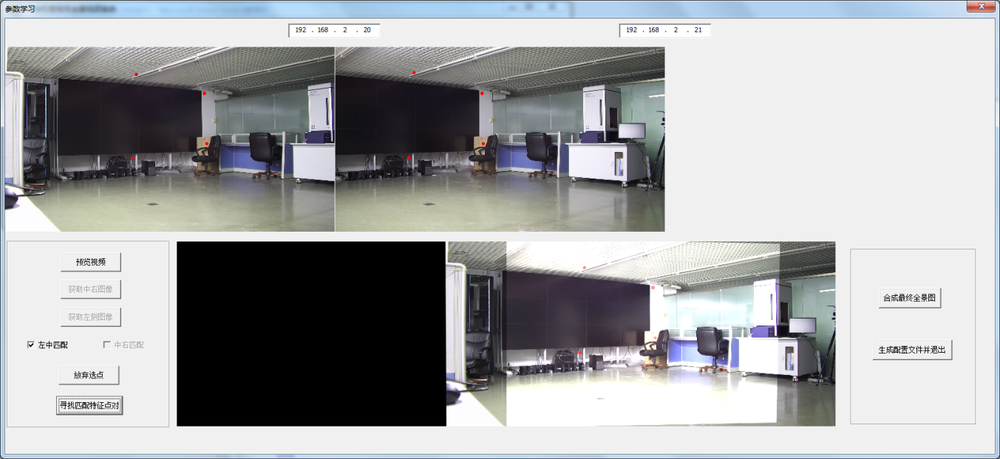

# VideoStitch
I use SURF algorithm to detect the featured point between two images, then RANSAC method is utilized to compute the homography matrix which is helpful for transforming one image to right postion to another. Every single frame is processed with the same procedure and video stiching can be implemented.

